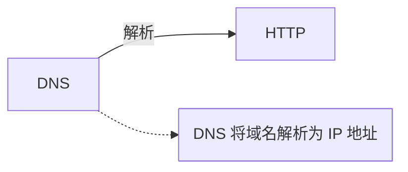

# 文章内容组件规范

本文档记录复合图文、思维导图、习题组件及打印配置。单张图片的资源导入和 `<Image>` 配置见 [IMAGE_USAGE.md](./IMAGE_USAGE.md)。

## 1. 文档类型与打印

文章可在 frontmatter 中声明：

```yaml
kind: exercise
exerciseFont: kai
```

| 字段 | 可选值 | 默认值 | 作用 |
| --- | --- | --- | --- |
| `kind` | `article`、`note`、`exercise`、`experiment` | `note` | 区分普通文章、知识笔记、习题与实验，并显示对应的打印设置 |
| `exerciseFont` | `kai`、`song`、`site` | `kai` | 设置文章内习题的默认字体；打印面板可临时覆盖 |

普通博客文章声明 `kind: article`，习题文章声明 `kind: exercise`，实验文章声明 `kind: experiment`；知识笔记可省略 `kind`。`article`、`note` 与 `experiment` 当前共用正文打印样式，但打印面板使用各自的标题与说明。

## 2. 指令语法

内容组件使用 Markdown container directive。属性使用 kebab-case，并建议加双引号：

```md
::::flow{mode="float" media-width="38%"}
:::media
媒体内容
:::
:::body
正文
:::
::::
```

嵌套层级越深，外层围栏使用越多的冒号。父子关系均指直系父子关系；容器之间不要插入普通段落。

## 3. 图像环绕与表格环绕

`flow` 将媒体与正文绑定在同一容器内，结束后自动清除环绕，不再需要空标题充当分隔符。

| 属性 | 可选值 | 默认值 | 作用 |
| --- | --- | --- | --- |
| `mode` | `block`、`float`、`split` | `block` | 上下排列、正文环绕、固定双栏 |
| `side` | `left`、`right` | `left` | 媒体所在侧 |
| `media-width` | CSS 长度或百分比 | `min(42%, 24rem)` | 媒体宽度 |
| `min-text-width` | CSS 长度 | `18rem` | 正文最小可读宽度；不足时自动上下堆叠 |
| `print` | `block`、`preserve` | `block` | 打印时改为上下排列或保留布局 |

`flow` 必须恰好包含一个 `media` 和一个 `body`。图片、Markdown 表格、代码块均可放入 `media`：

```md
::::flow{mode="split" media-width="44%" min-text-width="22rem"}
:::media
| 字段 | 含义 |
| --- | --- |
| TTL | 缓存有效期 |
:::
:::body
表格的解释文字。
:::
::::
```

`float` 适合短媒体和连续正文；需要稳定的两栏边界时使用 `split`。窄屏或正文剩余宽度不足时，两者都会自动堆叠。

## 4. 图像组

`image-group` 将多个图片放入同一网格，并支持共同图注：

```md
::::image-group{columns="2" mobile-columns="1" print-columns="2"}
<Image {...clientServerImage} />
<Image {...peerToPeerImage} />
:::caption
图 1　两类网络应用体系结构
:::
::::
```

| 属性 | 取值 | 默认值 |
| --- | --- | --- |
| `columns` | `1`–`4` | `2` |
| `mobile-columns` | `1`–`4` | `1` |
| `print-columns` | `1`–`4` | 与 `columns` 相同 |

每张 `<Image>` 可保留自己的 `caption`；`caption` 是可选的共同图注，最多一个。

### 4.1 竖排诗词

`poem` 用于短诗或词的竖排展示。每一行写成一个 Markdown 段落，组件使用放大的楷体文字，并按从右到左排列；在 `flow` 的 `body` 中使用时，容器高度会跟随同组媒体。移动端自动恢复为自然高度，打印时保留竖排样式。

```md
:::poem

雾起千灯下

高楼独守一轮月

星落远山眠

:::
```

## 5. 思维导图

`mindmap` 接受一段非空 Markdown 层级列表：

```md
:::mindmap{title="应用层知识结构" height="28rem" print-height="78mm" interactive="true"}
- 应用层
  - DNS
    - 域名空间
    - 资源记录
  - HTTP
:::
```

| 属性 | 可选值 | 默认值 |
| --- | --- | --- |
| `title` | 字符串 | `思维导图` |
| `height` | 非负十进制数 + `px`、`rem`、`em`、`vh`、`vw`、`mm`、`cm`、`in` 或 `pt` | `28rem` |
| `print-height` | 同 `height` | `112mm` |
| `interactive` | `true`、`false` | `true` |

交互模式支持平移、缩放和重新适配画布；较小的导图可用 `print-height` 减少打印留白。百分比、无单位数值及 `calc()`、`min()`、`max()`、`clamp()` 当前不受支持；长度或 `interactive` 写错时组件会回退到默认值，不会由 directive 校验直接报错。导图正文中不能嵌套其他 directive，也不要手写 `source` 属性。

## 6. 关系图

`diagram` 使用 Mermaid 绘制带方向、箭头、边标签和批注的关系图。它与树状知识结构使用的 `mindmap` 相互独立：

````md
::::diagram{title="DNS 与 HTTP 的关系"}



::::
````

`title` 是唯一支持的属性，省略时默认为“关系图”。`diagram` 内必须恰好包含一个非空的 `mermaid` 代码围栏；围栏前后必须留空行，否则 Markdown 会将其解析为普通文本。

第一版仅支持 `flowchart` 及其兼容别名 `graph`。方向、节点形状、箭头、虚线和边标签均使用 Mermaid DSL 表达；不支持初始化指令、HTML 标签、交互链接以及 sequence、class、state 等其他图表类型。网页显示静态 SVG，宽图只在组件内部横向滚动；打印时自动使用黑白配色。

## 7. 习题

### 7.1 层级

```text
exercise-set
└── exercise-group
    └── exercise
        ├── stem
        ├── parts
        ├── choices
        ├── answer
        ├── solution
        └── hint
```

每题必须有且仅有一个 `stem`；`answer`、`solution`、`hint` 各至多一个。顶层 `choices` 只用于 `single` 或 `multiple`。

### 7.2 最小示例

```md
::::::exercise-set{font="kai"}
:::::exercise-group{title="一、单项选择题" start="1"}
::::exercise{type="single" source="2027 计算机网络复习指导"}
:::stem
TCP 第二次握手中置为 1 的标志位是（　）。
:::
:::choices{choice-columns="auto"}
- SYN
- ACK
- RST
- SYN 和 ACK
:::
:::answer
D
:::
:::solution
第二次握手同时确认客户端的 SYN，并发送服务器自己的 SYN。
:::
::::
:::::
::::::
```

### 7.3 属性

| 指令 | 属性与默认值 |
| --- | --- |
| `exercise-set` | `font="kai\|song\|site"`；省略时继承文章的 `exerciseFont` |
| `exercise-group` | `title` 可选；`start` 默认为 `1`，且必须为不小于 1 的整数 |
| `exercise` | `type="single\|multiple\|judge\|fill\|short\|calculation\|proof"`，默认 `short`；`source` 可选；`answer-lines` 按题型取默认值；`keep-together` 按题型取默认值；`break-before` 默认为 `false` |
| `parts` | `start` 默认为 `1`；`choice-columns="auto\|1\|2\|4"` 默认为 `auto`，用于其嵌套选项 |
| `choices` | `start` 默认为 `1`；`choice-columns="auto\|1\|2\|4"` 默认为 `auto` |
| `answer`、`solution`、`hint` | `label` 分别默认为“答案”“解析”“提示”，只修改网页折叠标题 |

`answer-lines` 必须为非负整数。默认行数为：选择题与判断题 0 行、填空题 1 行、简答题 4 行、计算题 8 行、证明题 10 行。

`keep-together` 控制练习版中的单题题面是否尽量保持在同一页；选择、判断、填空默认开启，其余题型默认关闭。题解版允许长解析自然跨页，避免整题移页产生大块空白。分页由浏览器执行，因此“保持同页”是尽量满足的提示。`break-before="true"` 在所有打印模式下强制该题从新页开始。

`parts` 和 `choices` 的正文都必须恰好包含一个顶层 Markdown 列表。`parts` 显示圈号；每个小问内的直系嵌套列表会转换为 A、B、C 选项。`choice-columns="auto"` 根据最长选项自动选择 4、2 或 1 列，移动端仍会降列。

### 7.4 分问与嵌套选项

````md
::::::exercise-set
:::::exercise-group{title="二、综合题" start="3"}
::::exercise{type="calculation" source="教材例题" answer-lines="6"}
:::stem
分析下列两组报文，并完成各小问。
:::
:::parts{start="1" choice-columns="auto"}
1. 第一组报文的协议类型是（　）。
   - TCP
   - UDP
   - ICMP
   - ARP
2. 写出第二组报文的端到端时延。
:::
:::answer
① A；② $2RTT+T_{\text{data}}$。
:::
:::solution
第一组含有 TCP 首部；第二组按时间线累加握手、响应与数据传输时延。
:::
::::
:::::
::::::
````

`parts` 的一级列表显示为圈号；一级列表项中的列表显示为字母选项。若只需要整题的一组选项，应直接使用 `choices`，写法见上一节。

### 7.5 打印语义

- 打印页面使用 A4，页边距为上下 `14mm`、左右 `16mm`。
- `kind: exercise` 的文章可选择练习版或题解版；`article`、`note` 与 `experiment` 使用正文打印版式，并显示与文档类型对应的设置说明。
- 练习版隐藏答案、解析与提示，并按 `answer-lines` 预留答题空间。填空等题型显示横线；简答、计算和证明题只保留无横线的空白区域。
- 题解版展开并显示答案、解析与提示，不生成答题空间；打印标签固定为“答：”“解：”“提示：”，不受网页 `label` 属性影响。
- `exercise-set` 的 `font` 覆盖文章默认字体；打印面板显式选择字体时，再覆盖当前文章中的所有习题集。
- 题号使用固定宽度悬挂缩进。选择、判断、填空默认尽量整题同页；长题和题解允许自然跨页。

## 8. 检查

```bash
pnpm check:post-images
pnpm check:post-diagrams
pnpm typecheck
pnpm test:content
pnpm build
```

构建会校验 directive 的层级、必需子项，以及本文明确列出的枚举、整数和布尔属性；`mindmap` 还会校验正文非空且不含嵌套 directive。`diagram` 会在构建前使用 Mermaid 完整解析 DSL，语法错误将报告文章路径和 directive 行号并终止构建。当前不会统一拒绝其他组件的未知属性，也不会在 directive 阶段校验 `flow` 的 CSS 长度或 `mindmap` 的长度与 `interactive`，因此应严格使用本文列出的写法。图片声明与路径由 `check:post-images` 另行校验。
